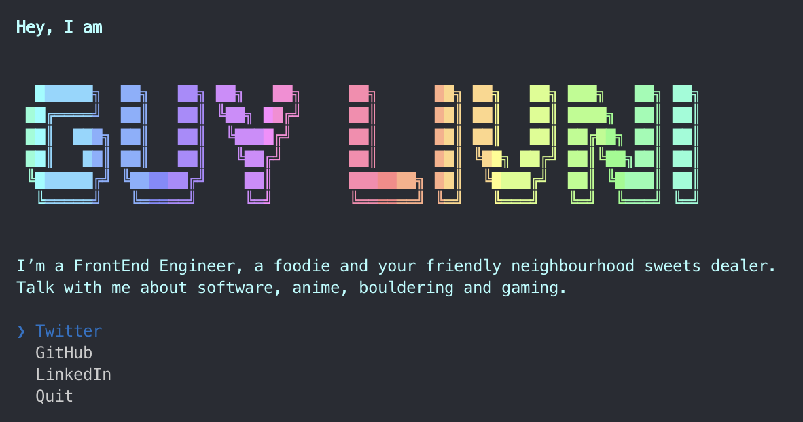

# guylivni

> The [Guy Livni](https://github.com/GuyLivni) CLI



## Usage

Install Node.js, then:

```
npx guylivni
```

## Built with
- [React](https://github.com/facebook/react) - A declarative, efficient, and flexible JavaScript library for building user interfaces
- [ink](https://github.com/vadimdemedes/ink) - 🌈 React for interactive command-line apps
- [babel](https://github.com/babel/babel) - 🐠 Babel is a compiler for writing next generation JavaScript.

## Inspiration

This is inspired by https://github.com/sindresorhus/sindresorhus


## LICENSE

MIT @ [Guy Livni](https://github.com/GuyLivni)
